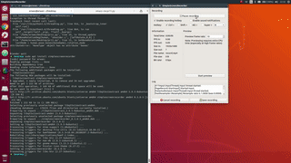

# OpenPose Puppet

**Notice:**  This is a project based on tf-pose-estimation (ildoonet).

---

## Requirements
  - **blender**

## RUN
  - cd skeleton
  - blender PR11.blend -P pr11.py

  - **new term**
  - cd tf-pose-estimation
  - python3 tf-pose-estimation/run_webcam.py --model=mobilenet_thin --resize=160x160 --camera=0